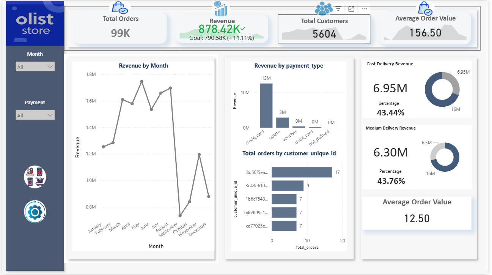
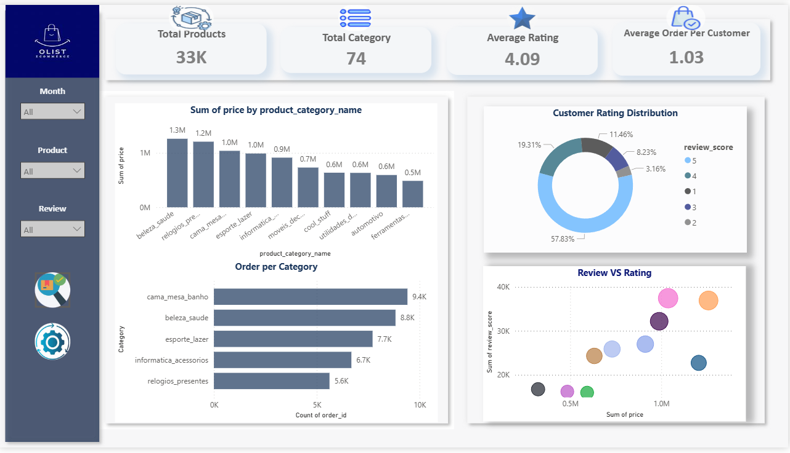
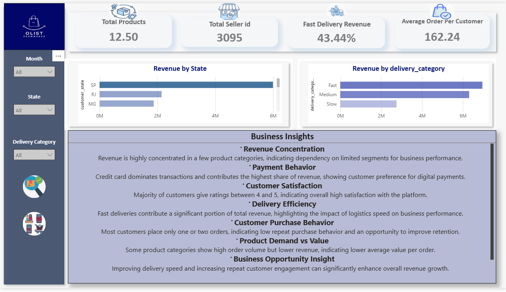

# E-commerce Sales & Operations Dashboard

## 📌 Overview
This project analyzes an e-commerce dataset using **Google BigQuery** and **Power BI** to understand business performance, customer behavior, and operational efficiency. The dashboard is designed as a multi-page interactive report covering sales, products, customers, and delivery insights.

---

## 🛠 Tools Used
- Google BigQuery (SQL)
- Power BI

---

## 📊 Dashboard Pages

### 🔹 1. Business Overview
- Revenue, Orders, Customers, AOV
- Monthly revenue trends
- Payment method analysis
- Delivery performance overview

---

### 🔹 2. Customer & Product Insights
- Revenue by product category
- Order demand vs revenue comparison
- Customer rating distribution
- Revenue vs rating relationship

---

### 🔹 3. Operations & Summary
- Revenue by state
- Delivery performance (Fast / Medium / Slow)
- Key business insights

---

## 📈 Key Insights
- Revenue is concentrated in a few product categories.
- Credit card dominates transactions and drives most revenue.
- Majority of customers give ratings between 4 and 5, indicating high satisfaction.
- Faster deliveries contribute significantly to total revenue.
- Business performance is concentrated in key regions.
- Most customers place only one or two orders, indicating low repeat behavior.

---

## 🔄 Customer Retention Analysis

A basic retention check was performed to understand repeat customer behavior.

### Key Observation:
- A large majority of customers have only **one purchase**
- Very few customers return for additional orders

### Insight:
- Customer retention is **low**, limiting long-term revenue growth
- Retention analysis (cohort-wise) is not highly meaningful due to limited repeat purchases

### Business Recommendation:
- Introduce loyalty programs or targeted marketing campaigns
- Improve customer engagement to increase repeat purchases

---

## ⚙️ Data Processing (BigQuery)
- Cleaned and transformed raw data using SQL in Google BigQuery
- Joined multiple datasets (orders, order_items, customers, products, payments)
- Created derived metrics such as delivery time and revenue measures

---

## 📌 Notes
- Power BI (.pbix) file is available upon request
- Dashboard includes slicers and page navigation for interactivity
- Analysis focuses on business insights rather than raw data exploration

---
